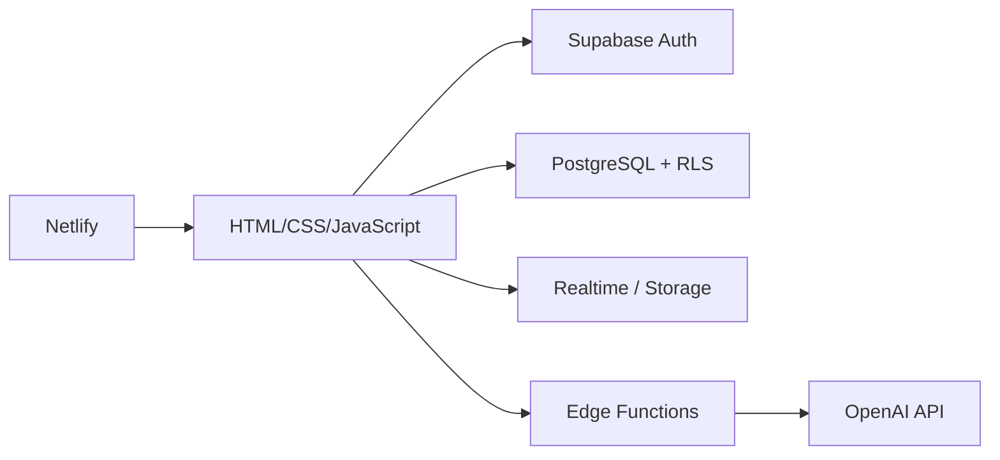

# 고교 AI 경진대회 — 팀가치(TeamGachi)

> **시너지온**이 만드는 소규모 팀 프로젝트 통합 협업 웹 서비스

팀가치는 채팅, 일정, 자료 공유, 할 일과 팀원별 진행 상황을 한곳에 모으고, AI가 대화 요약과 할 일 우선순위 추천을 지원하는 서비스입니다.

## 1. 프로젝트 개요

### 문제 인식

팀 프로젝트를 진행할 때 채팅은 카카오톡, 일정은 구글 캘린더, 자료는 구글 드라이브, 집중 시간은 별도 앱으로 나뉩니다. 이 때문에 대화 맥락과 자료가 흩어지고 팀 전체의 진행 상황을 한눈에 파악하기 어렵습니다.

### 해결 방법

- 할 일·공지·일정·진척도를 하나의 대시보드에서 확인
- Supabase Realtime을 이용한 팀 채팅
- Supabase Storage를 이용한 팀 자료함
- AI가 팀 채팅을 요약하고 할 일의 우선순위를 추천

### 타겟 사용자

- 3~6명 규모의 학생 팀 프로젝트·공모전·대회 팀
- 여러 협업 도구를 오가는 데 피로감을 느끼는 팀
- 팀원 간 진행 상황 공유가 어려운 소규모 팀

## 2. MVP 기능

| 우선순위 | 기능 | 설명 | AI 적용 |
| --- | --- | --- | --- |
| Must | 로그인·회원가입 | 이메일 기반 사용자 인증과 프로필 생성 | — |
| Must | 메인 대시보드 | 할 일·공지·일정·진척도 요약 | — |
| Must | 할 일 | 등록·조회·완료·삭제, 마감일 관리 | 우선순위 추천 |
| Must | 채팅·자료함 | 실시간 메시지와 파일 업로드·다운로드 | 대화 요약 |
| Must | 업무 분담·진척도 | 팀원별 업무 배정과 진행률 | — |
| Should | 캘린더·공지사항 | 월간 일정, D-Day, 공지 확인 여부 | — |
| Could | 집중 타이머·인증 피드 | 뽀모도로와 누적 작업 시간 | — |

## 3. 기술 스택

| 구분 | 사용 기술 | 역할 |
| --- | --- | --- |
| 프론트엔드 | HTML, CSS, JavaScript | Figma 디자인 구현과 화면 동작 |
| 백엔드·DB | Supabase Auth, PostgreSQL | 로그인과 팀별 데이터 저장 |
| 실시간 | Supabase Realtime | 채팅과 할 일 실시간 갱신 |
| 파일 | Supabase Storage | 팀 파일 업로드·다운로드 |
| AI | Supabase Edge Functions + OpenAI | 채팅 요약·우선순위 추천 |
| 배포 | Netlify + Supabase | 정적 프론트엔드·서버리스 백엔드 |
| 협업 | GitHub + Figma | 코드·디자인 공유 |

## 4. 서비스 구조



브라우저에는 Supabase Publishable Key만 사용합니다. DB 비밀번호, Secret Key, OpenAI API 키는 프론트엔드나 GitHub에 저장하지 않습니다.

## 5. 현재 구현 상태

### Phase 0 — 준비

- [x] Git·GitHub·개발 환경 준비
- [x] 팀 저장소 생성과 팀원 초대
- [x] 기획·프론트엔드·백엔드 역할 확정

### Phase 1 — 기획·데이터 구조

- [x] MVP 범위 확정
- [x] Figma 와이어프레임 작성
- [x] User, Team, Todo, Schedule, Message, File, Notice, Timer, Progress 데이터 구조 설계
- [x] 팀별 데이터 접근을 제한하는 RLS 정책 설계
- [ ] 전체 화면 흐름과 AI 출력 형식 최종 합의

### Phase 2 — 기본 세팅

- [x] Supabase `teamgachi` 프로젝트 생성(서울 리전)
- [x] DB 마이그레이션 3개와 12개 주요 테이블 배포
- [x] Auth 프로필 자동 생성과 팀 멤버 권한 설정
- [x] Realtime 대상 테이블과 Storage 보안 정책 설정
- [x] HTML/CSS/JavaScript 폴더와 GitHub 협업 저장소 준비
- [ ] Netlify 최초 배포와 실제 URL 확인

### Phase 3 — 첫 기능 완성

- [x] 로그인·회원가입·로그아웃·비밀번호 재설정 코드 연결
- [x] 팀 생성·선택 연결
- [x] 할 일 등록 → Supabase 저장 → 표시 → 완료 체크 → 삭제 연결
- [x] 할 일 Realtime 갱신 연결
- [ ] 실제 이메일 계정으로 전체 사이클 통합 테스트

### Phase 4 — 기능 확장

- [ ] 메인 대시보드 실제 데이터 요약
- [ ] 실시간 팀 채팅 화면 연결
- [ ] 자료함 파일 업로드·다운로드 연결
- [ ] 업무 분담·진척도 화면 연결
- [ ] 캘린더·공지사항·집중 타이머 연결

백엔드의 Message, File, Schedule, Notice, Timer, Progress 테이블과 보안 정책은 준비되어 있으며 프론트 화면 연결이 남아 있습니다.

### Phase 5 — AI

- [x] `summarize-chat` Edge Function 구현·배포
- [x] `recommend-priority` Edge Function 구현·배포
- [x] API 키가 브라우저에 노출되지 않는 서버리스 구조 적용
- [ ] Supabase에 OpenAI API 키 등록
- [ ] 채팅 요약·우선순위 추천 1건 PoC와 화면 연결

### Phase 6 — 마무리

- [ ] 전체 기능 통합 테스트
- [ ] 로딩·실패 메시지와 예외 처리 보완
- [ ] PC·태블릿·모바일 반응형 QA
- [ ] 디자인 폴리싱과 최종 배포
- [ ] 발표 자료와 시연 시나리오 제작

## 6. 폴더와 주요 파일

```text
AI-contest/
├─ index.html              # 세션에 따라 로그인/대시보드 이동
├─ login.html              # 로그인 화면
├─ signup.html             # 회원가입 화면
├─ reset-password.html     # 비밀번호 재설정
├─ dashboard.html          # 팀·할 일 연결 검증 대시보드
├─ auth.js                 # Supabase Auth 연결
├─ dashboard.js            # 팀·할 일 CRUD와 Realtime
├─ supabase-client.js      # Supabase 브라우저 클라이언트
├─ config.js               # Project URL과 Publishable Key
├─ style.css               # 공통 화면 스타일
└─ netlify.toml            # Netlify 배포 설정
```

## 7. 로컬 실행

JavaScript 모듈을 사용하므로 HTML 파일을 직접 더블클릭하지 말고 정적 파일 서버로 실행합니다.

```powershell
npx.cmd --yes serve . --listen 4174
```

Windows에서는 `start-preview.cmd`를 실행해도 됩니다.

## 8. 팀원과 업무 분담

이 프로젝트는 설치형 앱이 아닌 **HTML/CSS/JavaScript 기반 웹 서비스**로 개발합니다.

| 팀원 | 담당 | 주요 업무 |
| --- | --- | --- |
| 박서아 | 기획·디자인·총괄(PM) | 핵심 가치·MVP·화면 흐름 결정, Figma 디자인, 일정·QA·발표 관리 |
| 이시윤 | 프론트엔드 | Figma를 웹 UI로 구현, Supabase 연결 함수를 화면에 적용, 반응형·로딩·오류 처리 |
| 함서희 | 백엔드·DB·AI·배포 | Supabase 스키마·RLS·Auth·Realtime·Storage, Edge Functions, 비밀키와 배포 관리 |

역할의 경계를 완전히 나누지는 않으며, 데이터 구조와 API 형식은 세 명이 함께 검토합니다.

## 9. 협업 규칙

- 작업 전 `git pull`로 최신 코드를 받습니다.
- 기능 하나가 동작하는 작은 단위로 커밋합니다.
- Secret Key, DB 비밀번호, OpenAI API 키는 커밋하지 않습니다.
- 프론트와 백엔드는 데이터 필드 이름과 반환 형식을 먼저 합의합니다.
- 새 기능은 작은 테스트 화면에서 성공시킨 뒤 실제 UI에 적용합니다.
- 3일 이상 막히는 기능은 이슈로 기록하고 우선순위를 조정합니다.

## 10. 저장소

- 팀 협업 원본: [xr7qvna/AI-contest](https://github.com/xr7qvna/AI-contest)
- Netlify 배포용 포크: [gkatjgml3/teamgachi-frontend](https://github.com/gkatjgml3/teamgachi-frontend)
- Supabase 백엔드 코드: [gkatjgml3/teamgachi](https://github.com/gkatjgml3/teamgachi)
